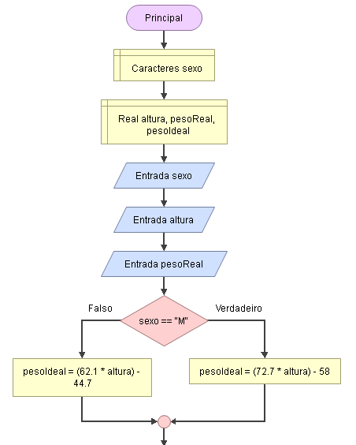
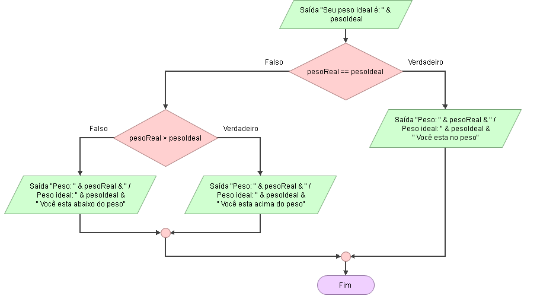

# Enunciado
Elaborar um programa que verifique se o paciente está acima de seu peso ideal de acordo com a condição a seguir:

•Para homens: (72.7 * altura) – 58.
•Para mulheres: (62.1 * altura) – 44.7

## Fluxograma

