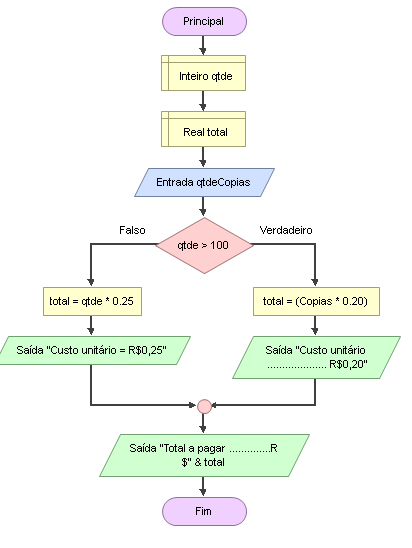

# Enunciado
Escrever um programa que resolva o seguinte problema: uma fotocópia custa  R$  0,25  por  folha,  mas  acima  de  100  folhas  esse  valor  cai  para  
R$ 0,20 por unidade. Dado o total de cópias, informe o valor a ser pago.

## Fluxograma
<div align="center"></div>

## Pseudocódigo
```

```
