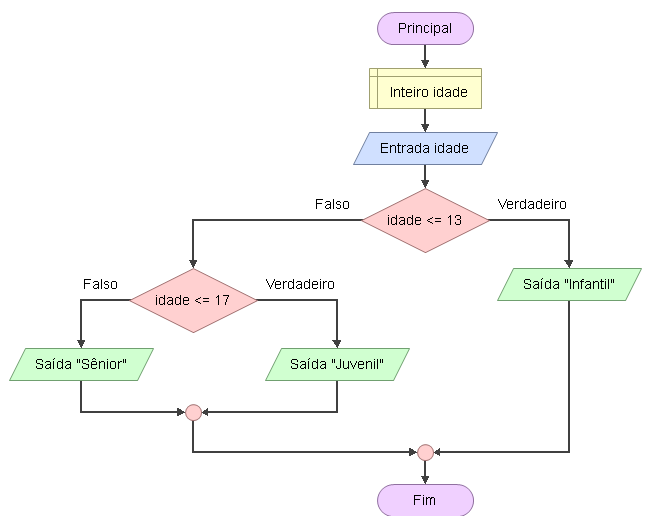

# Enunciado
Escrever um programa que informe a categoria de um jogador de futebol, considerando sua idade: 

• Infantil: até 13 anos.

• Juvenil: até 17 anos.

• Sênior: acima de 17 anos.

## Fluxograma
<div align="center"></div>

## Pseudocódigo

```
programa
{
	
	funcao inicio()
	{
		//Declarar Variáveis
		inteiro idade

		escreva("Verifica a categoria baseado na idade\n----------------------------\n")

		//Entradas
		escreva("Qual é sua idade? :")
		leia(idade)

		se(idade <= 13){
			escreva("Infantil: até 13 anos")
		}
		senao{
			se(idade <= 17){
				escreva("Juvenil : até 17 anos")
			}
			senao{
				escreva("Senior: maior de idade")
			}
		}
	}
}
```
