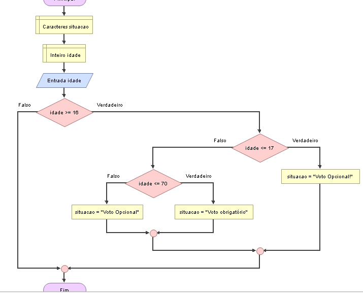

# Enunciado
Escrever um programa que solicite a idade do usuário e exiba sua condição eleitoral:

• Entre 16 e 17 anos: voto opcional.
• Entre 18 e 70 anos: voto obrigatório.
• Acima de 70 anos: voto opcional.

## Fluxograma


## Peseudocódigo

``` 
programa
{
	
	funcao inicio()
	{
	
		//Declarar Variáveis
		cadeia situacao = "Indefinido"
		inteiro idade

		escreva("Verifica a situação eleitoral baseado na idade\n")
		
		//Entradas
		escreva("Qual sua idade ? :")
		leia(idade)
		
		se(idade >= 16){
			se(idade <= 17){
				situacao = "Voto opcional"
			}
			senao{
				se(idade <= 70){
					situacao = "Voto obrigatório"
				}
				senao{
					situacao = "Voto opcional"
				}
			}
		}

		escreva("Situação.......: " + situacao)
		
	}
}
```
