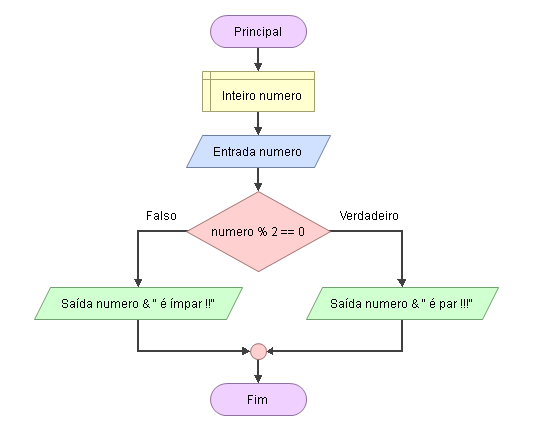

# Enunciado
Utilizando a estrutura condicional composta, verifique se um número é par ou ímpar e escreva na tela a mensagem correspondente, conforme os exercícios 1 e 2.

## Fluxograma (Flowgorithm)
<div align="center">
  
</div>

## Pseudocódigo
```

```
