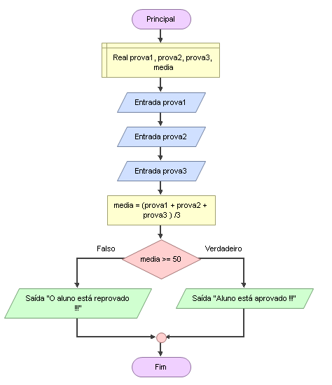

# Enunciado
Em uma escola, as notas de cada prova variam de 0 até 100. Para o cál-culo da média do semestre, o aluno precisa fazer três provas. Fazer um programa que solicite o valor da cada prova, calcule a média aritmética delas  e  mostre  se  ele  foi  aprovado  ou  reprovado.  Para  ser  aprovado,  a  média deve ser igual ou maior do que 50. Média = (Prova1 + Prova2 + Prova3) / 3

## Fluxograma (Flowgorithm)

