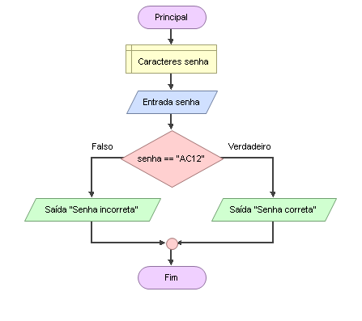

# Enunciado
Escrever um programa que teste se a senha informada é igual a “AC12”. Se sim, exibir a mensagem “Senha correta” e, se não, exibir “Senha errada”.

## Fluxograma (Flowgorithm)
<div align="center"></div>

## Pseudocódigo
```
programa
{
	
	funcao inicio()
	{
		//declarar variáveis
		cadeia senha

		escreva("Verifica se a senha informada está correta \n")

		//Entradas
		escreva("Insira sua senha: ")
		leia(senha)

		//Decisão + Saída
		se(senha == "AC12"){
			escreva("senha correta !!!!")
		}
		senao{
			escreva("senha incorreta !!!")
		}
		
	}
}
```
