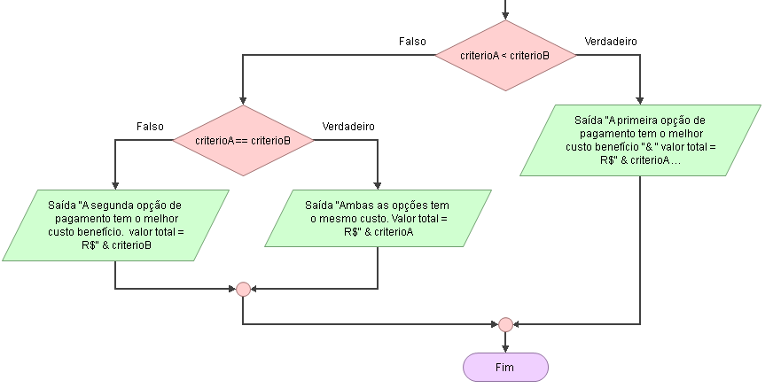

# Enuncaiado
Uma livraria está fazendo uma promoção para pagamento à vista em que o comprador pode escolher entre dois critérios de desconto:

* Critério A: R$ 0,25 por livro + R$ 7,50 fixo
* Critério B: R$ 0,50 por livro + R$ 2,50 fixo

## Fluxograma (Flowgorithm)
<div style="margin-left:125px"></div>

<div style="margin-left:56px"></div>

## Pseudocódigo

```

```

