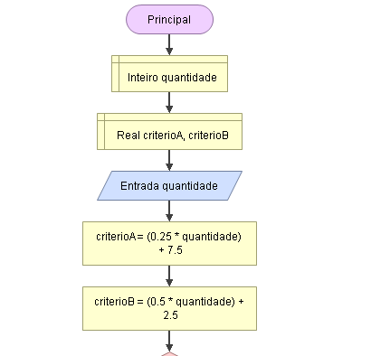

# Enuncaiado
Uma livraria está fazendo uma promoção para pagamento à vista em que o comprador pode escolher entre dois critérios de desconto:

a)Critério A: R$ 0,25 por livro + R$ 7,50 fixo
b)Critério B: R$ 0,50 por livro + R$ 2,50 fixo

## Fluxograma (Flowgorithm)

