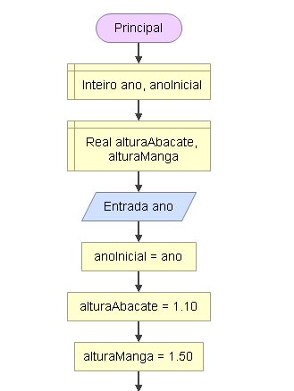
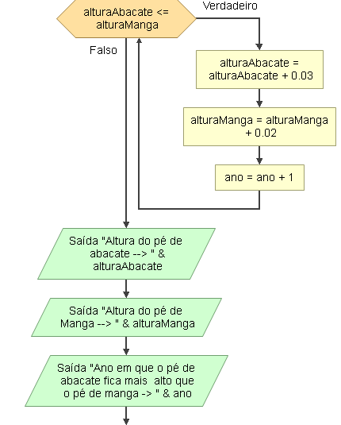
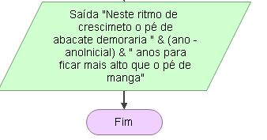

# Enunciado
Em que ano, contando a partir do ano atual, um pé de abacate fica mais alto do que um pé de manga? O pé de manga tem 1,50 m e cresce 2 centímetros por ano, 
e o pé de abacate tem 1,10 m e cresce 3 centímetros por ano. Faça um programa para responder essa pergunta, utilizando uma das estruturas de repetição.

## Fluxograma 
<div align="center"></div>
<div align="center"></div>
<div align="center"></div>

## Pseudocódigo
```
programa
{
 inclua biblioteca Matematica --> math
	
	funcao inicio()
	{
		//Declarar Variáveis
		inteiro ano, anoInicial
		real alturaManga, alturaAbacate
		
		alturaManga = 1.50
		alturaAbacate = 1.10

		escreva("Em que ano estamos? ")
		leia(ano)

		anoInicial = ano
		
		enquanto(alturaAbacate <= alturaManga){
			alturaAbacate = alturaAbacate + 0.03
			alturaManga = alturaManga + 0.02
			ano = ano + 1
		}

		
		escreva("Altura do pé de abacate -> " + math.arredondar(alturaAbacate, 2) + "\n" )
		escreva("Altura do pé de manga -> " + math.arredondar(alturaManga, 2) + "\n")
		escreva("Ano em que o pé de abacate fica mais  alto que o pé de manga -> " + ano)
		escreva("\nNeste ritmo de crescimeto o pé de abacate demoraria " + (ano - anoInicial) + " anos para ficar mais alto que o pé de manga o pé de manga")
	}
}
```
