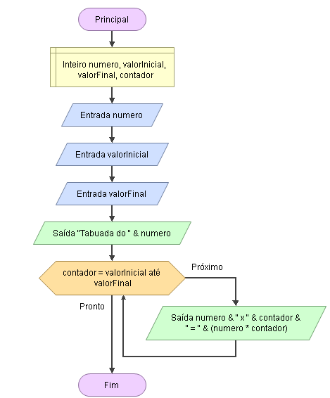

# Enunciado
Faça um programa para fazer uma tabuada solicitando:•Tabuada de qual número?•Começar a tabuada com qual valor?•Fazer a tabuada até qual valor?

## Fluxograma
<div align="center"></div>

## Pseudocódigo
```
programa
{
	
	funcao inicio()
	{
		//Declarar variáveis
		inteiro numero, valorInicial, valorFinal, contador
		
		//Entradas
		escreva("Insira um número para criarmos a tabuada dele: ")
		leia(numero)
		
		escreva("Começar a tabuada em qual valor ? ")
		leia(valorInicial)
		
		escreva("Fazer a tabuada até qual valor ?  ")
		leia(valorFinal)
		
		para(contador = valorInicial; contador <= valorFinal; contador++){
			escreva(numero + " X " + contador + " = " + (numero * contador) + "\n")
		}
	}
}
```

