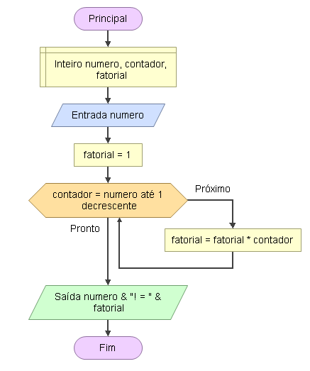

# Enunciado
Faça um programa que solicite um valor ao usuário e calcule o fatorial desse número.

## Fluxograma
<div align="center"></div>

## Pseudocódigo

```
programa
{
	
	funcao inicio()
	{
		//Declarar variáveis
		inteiro numero, contador, fatorial = 1

		escreva("Fatorial de = ")
		leia(numero)

		para(contador = numero; contador >= 1; contador--){
			fatorial = fatorial * contador
		}

		escreva(numero + "!" + " = " + fatorial)
	}
}
```
