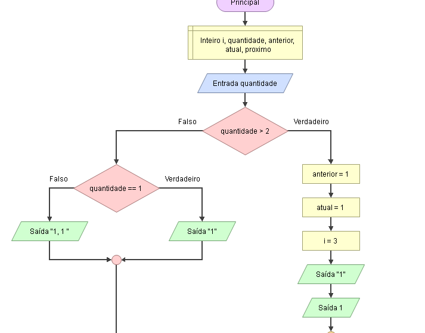
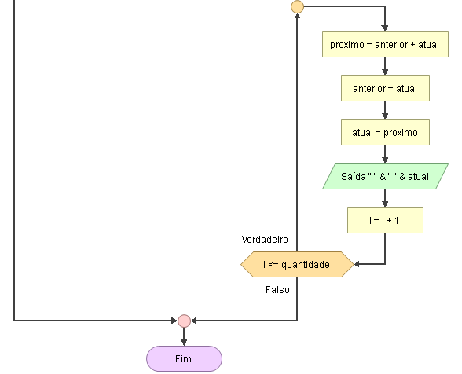

# Enunciado
Faça um programa que, dada a sequência de Fibonacci (11235813...n),solicite um número inteiro ao usuário e mostre todos os valores da sequência da posição 1 
até a posição informada pelo usuário. Por exemplo, se o usuário digitou o número 10, deverão ser gerados 10 números. Lembre-se de que existem limitações para armazenar 
valores em uma linguagem de programação

## Fluxograma
<div  ></div>
<div align="center" ></div>

## Pseudocódigo

```

``` 
