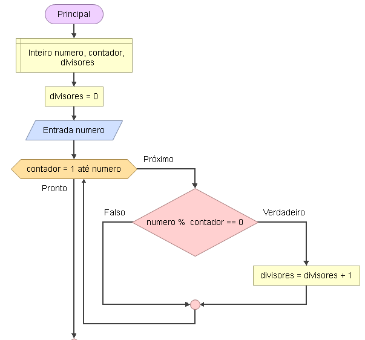
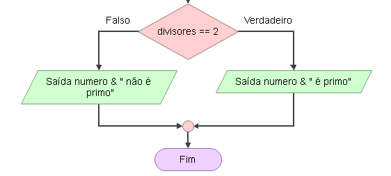

# Enunciado
Faça um programa que solicite um valor ao usuário e verifique se esse valor é um número primo. Utilize uma estrutura de repetição na solução deste exercício.

## Fluxograma
<div align="center"></div>
<div align="center"></div>

## Pseudocódigo
```

```


