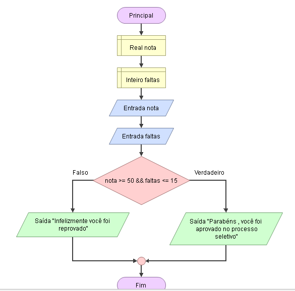

# Enunciado
Para ser aprovado em uma instituição de ensino, o aluno precisa de nota igual ou superior a 50 e a quantidade de faltas deve ser igual ou menor do que 15. 
Faça um programa que solicite nota e falta do aluno e verifique se ele está aprovado ou reprovado

## Fluxograma
<div align="center"></div>

## Pseudocódigo
```

```

