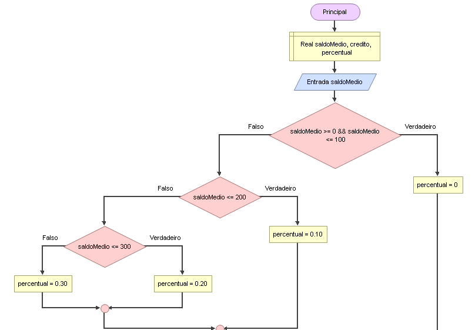
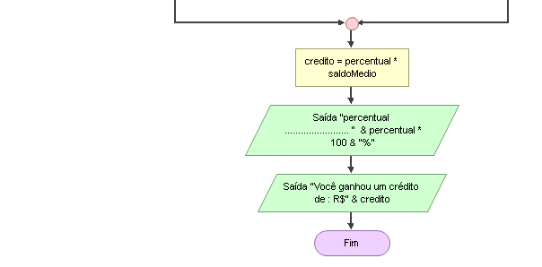

# Enunciado
Um  banco  concederá  um  crédito  especial  aos  seus  clientes de  acordo  com o saldo médio do último ano. Faça um programa que solicite o saldo médio do cliente, calcule o valor do crédito e exiba uma mensagem com o saldo médio e o valor do crédito. Utilize a tabela a seguir como referência.
Saldo médio | crédito
----------- | -------
 0 a 100    | 0%
 101 a 200  | 10%
 201 a 300  | 20%
 Acima de 301 | 30%
 
 ## Fluxograma
 

 

