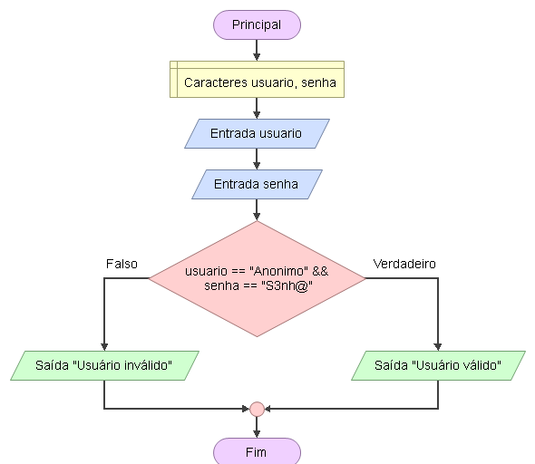

# Enunciado
Para acessar um site, o usuário deve informar um nome e senha. Se o nome for “Anonimo” e a senha for “S3nh@”, então o site é acessado. Caso contrário, os dados não poderão ser acessados. Faça um programa que solicite o nome e a senha do usuário, compare com os valores do exercício e determine se o usuário poderá ou não acessar o site.

## Fluxograma
<div align="center"></div>

## Pseudocódigo
```

```
