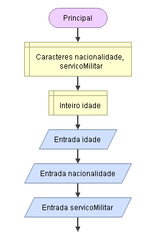
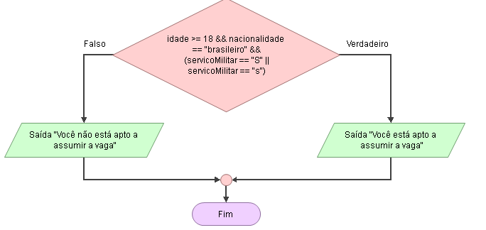

# Enunciado
Para preencher uma vaga em uma empresa, o candidato do sexo masculi-no deverá ser brasileiro, ter 18 anos ou mais e estar em dia com o serviço militar. Faça um programa que solicite os dados desse candidato, faça a expressão lógica que verifique as três condições e determine se ele está apto ou não para assumir a vaga.

## Fluxograma

