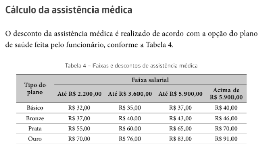

# Enunciado

O exercício proposto aqui é desenvolver uma aplicação que automatize a tarefa de gerar folhas de pagamento , sendo que no momento essa função é realizada de maneira manual através de uma planilha eletrônica. O usuário deve inserir dados como: 

* nome 

* salário bruto

*  plano de saúde 

* número de dependentes para cálculo do Imposto de Renda.

  

 O programa recebe essas informações e calcula os descontos como: 

* inss 
* vale-transporte 
* vale-refeição 
* vale-alimentação
*  imposto de renda retido na Fonte 
* assistência médica  
* seguro de vida

No final o programa exibe a receita e as despesas do funcionário bem como o salário líquido dele, ou seja, o salário que já sofreu os descontos.

-----

### Regras para cálculo dos descontos :robot:

#### INSS

 

#### Vale-transporte :bus:

 

#### Vale-refeição :bread:

 

#### Vale-alimentação :banana:

 

 

#### Assistência médica :hospital:

 

#### Seguro de vida 

 

#### IRRF (Imposto de renda retido na fonte) :lion:

 

 

----

Para consultar o **código fonte** da aplicação baixe o arquivo **.por** localizado na raiz deste diretório e abra-o utilizando o **Portugol Studio**.

